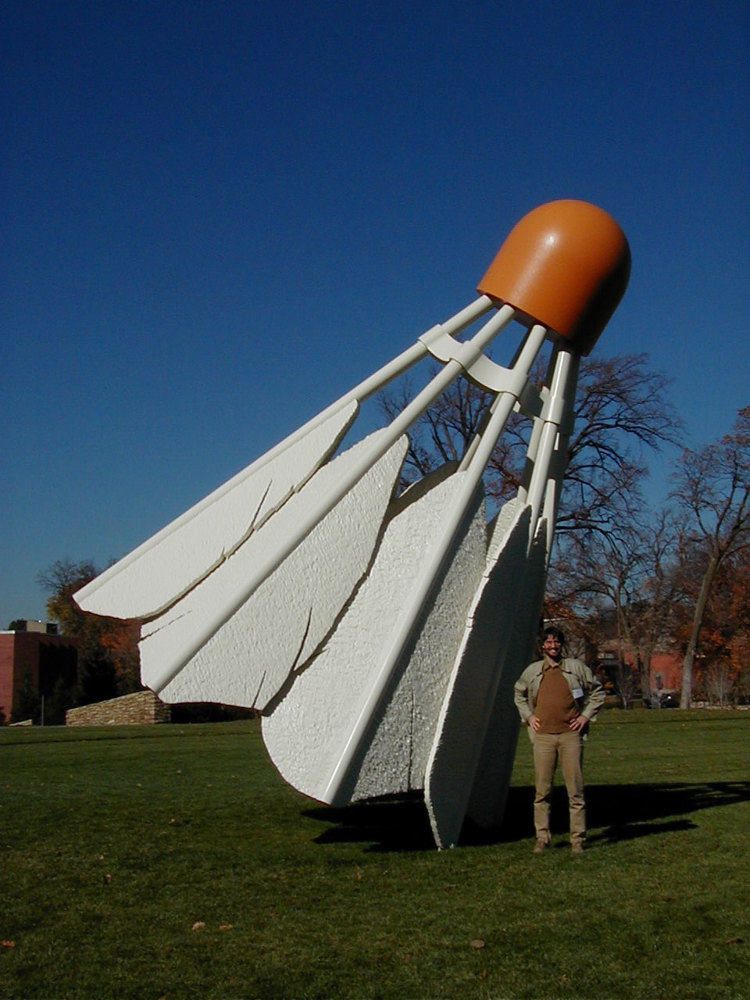

```{r include=FALSE}
knitr::opts_chunk$set(
    echo = FALSE
  , warning = FALSE
  , message = FALSE
)

library(tidyverse)
library(gridExtra)
```

## Agenda

* Seeing numbers
* Seeing hypotheses
* Seeing models

# Seeing numbers

## The Zen mountain

“Before I studied Zen, I saw mountains as mountains and rivers as rivers. When I had studied Zen for thirty years I no longer saw mountains as mountains and rivers as rivers. But now that I have finally mastered Zen, I once again see mountains as mountains and rivers as rivers.”

> Ch’an master Ch’ing Yuan

## Seeing a thing is not the same as seeing a thing

```{r out.height='600px'}

```

http://plotnickdm.blogspot.com/2010/11/claes-oldenburg.html

## The Treachery of Images

```{r}
knitr::include_graphics('images/MagrittePipe.jpg')
```

By Image taken from a University of Alabama site, "Approaches to Modernism": [1], Fair use, https://en.wikipedia.org/w/index.php?curid=555365

## Visual representation of the number 17

## Sanskrit

```{r}
# knitr::include_graphics()
```

## Binary

## Bavarian

## 

Arabic/sanskrit no more legitimate than any other representation

_We can no more see numbers than we can hear, smell or taste them._

## Many numbers - statistics

Statistics maps a set of many numbers into a smaller set of numbers.

_The summary is not the same as all of the numbers!!_

##

```{r echo = TRUE}
set.seed(1234)
tbl_obs <- tibble(
  x = rlnorm(5e3, meanlog = log(10e3), sdlog = 0.5)
)

tbl_obs$x %>% 
  summary()
```

## Many numbers visually

```{r}
plt_base <- tbl_obs %>% 
  ggplot(aes(x))

plt_hist <- plt_base + 
  geom_histogram(
      aes(y = stat(density))
    , fill = 'grey'
    , color = 'black')

grid.arrange(
    nrow = 1
  , plt_hist
  , plt_base + geom_density(fill = 'grey')
)
```

# Seeing hypotheses

## Hypotheses = assumptions

1. Form of distribution
2. Parameters ==> Moments of distribution

## 

```{r}
library(MASS)
fit_lnorm <- fitdistr(
    tbl_obs$x
  , 'log-normal'
)

est_meanlog <- fit_lnorm$estimate[1]
est_sd <- fit_lnorm$estimate[2]

tbl_obs <- tbl_obs %>% 
  mutate(
      percentile = percent_rank(x)
    , density_lnorm = dlnorm(x, est_meanlog, est_sd)
  )
```

```{r}
plt_hist +
  geom_line(data = tbl_obs, aes(x, density_lnorm), color = 'red')
```

##

```{r}
plt_hist +
  geom_line(data = tbl_obs, aes(x, density_lnorm), color = 'red') +
  scale_x_continuous(limits = c(0, 20e3))
```

## Other parameters

## Other functional forms

```{r}
fit_gamma <- fitdistr(tbl_obs$x, 'gamma', start = list(shape = 10, rate = .01))
fit_weibull <- fitdistr(tbl_obs$x, 'weibull')

tbl_obs <- tbl_obs %>% 
  mutate(
      density_gamma = dgamma(x, fit_gamma$estimate[1], fit_gamma$estimate[2])
    , density_weibull = dweibull(x, fit_weibull$estimate[1], fit_weibull$estimate[2])
  )
```

## Differences

```{r}

```


## Kolmogorov-Smirnov

```{r}

```

## Visualizing hypotheses

* Visual 

##

_For stochastic processes, all of the numbers is not the same as the process!!_

# Seeing models

## 

_Actually, we already did!_

## Linear

```{r}
sims <- 500
tbl_linear <- tibble(
    age = sample.int(18:70, sims, replace = TRUE)
  , gender = sample(c('male', 'female' ,'other'), sims, replace = TRUE)
  , income = rlnorm(sims, meanlog = log(50e3), sdlog = 0.5)
  , bmi = rnorm(sims, 22, 2)
  , eta = a
  , mu = exp(eta)
  , claim_count = rpois(sims, mu) 
)
```

## Linear

Same things to hypothesize

## Trees

## Variable importance

## Neural networks?

# Conclusion

## Wrapping up

* 

## Where to find this

This presentation may be found at: http://pirategrunt.com/soa_symposium_2018/#/

Code to produce the examples and slides: https://github.com/PirateGrunt/soa_symposium_2018 

## Thank you!